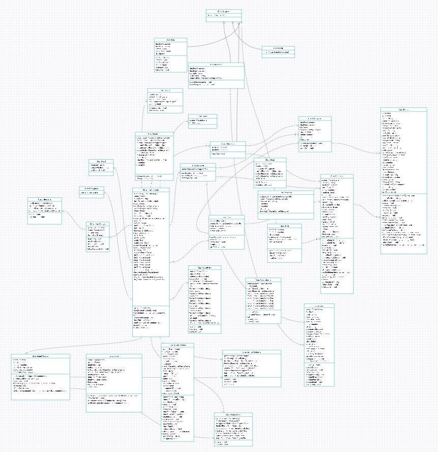
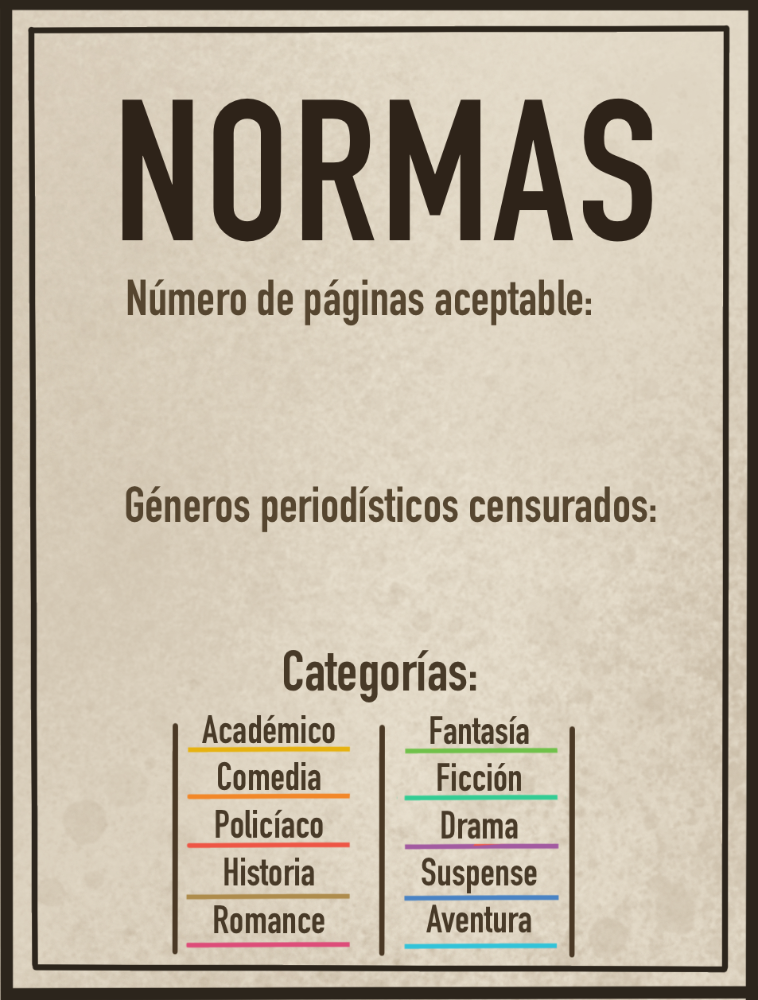

# EditorialZaratustra
**EDITORIAL ZARATUSTRA**

**Documento de diseño de videojuego**

**Grupo 09**

_Daniel Illanes, Alejandro Ortega, Miguel Hernández, Sergio José Alfonso (Chikito)_

Versión Final - 22 de enero de 2021

**Página del juego**
https://mihern07.github.io/EditorialZaratustra/

**Página de gestión (Pivotal)**
https://www.pivotaltracker.com/projects/2470815

| **Resumen** |
| --- |
| **Géneros:**
Point and click |
| **Público objetivo:**
Mayores de 12 años. |
| **Modos:**
Un jugador |
| **Plataformas:**
PC con teclado y ratón. |
| **Hitos:**
Fecha de propuesta del concepto (14/10/2020)_
Fecha de lanzamiento (22/01/2021) |

**Descripción**

El juego se sitúa en el Madrid de los años 20. Nos encontramos en la recepción de la Editorial Zaratustra, donde nuestro trabajo será decidir si los libros que nos entregan serán rentables a la editorial al más puro estilo &quot;Papers, Please&quot;. A lo largo de las jornadas, la partida se irá complicando, de manera que el jugador tendrá que tener más factores en cuenta para hacer bien su trabajo y no ser despedido.

**Logotipo y portada del juego**

**Tabla de contenidos**

1. Aspectos Generales

2. Menús y modos de juego

2.1. Control

3. Jugabilidad

3.1. Mecánica

3.2. Dinámica

3.3. Estética

3.4. Eventos

4. Arquitectura

5. Contenido

5.1. Contexto y universo

5.2. Historia

5.3. Narrativa

5.4. Niveles

5.5. Objetos

5.6. Sonido SFX

6. Referencias

7. Links

///////////////////////////////////////////

1. **Aspectos generales**

Se busca un loop jugable rápido, donde el jugador deberá tener en cuenta varios factores para hacer bien su trabajo al igual que en Papers Please. Las mecánicas diferirán de lo que nos podemos encontrar en el juego de Lucas Pope, y vendrán explicadas más adelante.

2. **Menús y modos de juego**

Desde el menú principal se podrá acceder a las opción &quot;Jugar&quot;, que llevará al jugador al primer nivel.

_Imagen del menú

Desde el menú de pausa se podrá acceder a la opción "Continuar" y a la opción "Salir", que llevará al jugador al nivel principal. También podrá activar y desactivar la música mediante el icono de audio.

_Imagen del menú de pausa

**2.1 Control**

Tiene un control similar a Papers Please, en el que se utilizará el ratón para ver los detalles de los diferentes objetos en la mesa y mover los que sean necesarios. Se utilizará el click izquierdo para arrastrar objetos por la mesa, avanzar ciertos diálogos, tocar el timbre y el botón de seguridad. El click derecho servirá para abrir documentos arrastrables, como las normas, los libros y los periódicos.

3. **Jugabilidad**

**3.1 Mecánica**

- Admitir/Denegar
  - Point and Click sobre la pluma para arrastrarla y firmar sobre un documento de acceso que te entrega el jugador. En función de lo que decida el jugador se usará tinta roja o verde, que cambiará dependiendo de si el jugador pasa la pluma por cada uno de los 2 tinteros diferentes.
- Llamar al siguiente cliente
  - El jugador podrá llamar al siguiente cliente en la cola pulsando un timbre que se encuentra en el mostrador. Este timbre sólo podrá ser utilizado cuando no se esté atendiendo a alguien en el mostrador.
  - El cliente entregará un libro y un documento de acceso.
- Abrir y mover libros y periódicos
  - Se podrán arrastrar los papeles a lo largo de la mesa pulsando en ellos y arrastrandolos. En ellos se verá si se trata de un _Libro_ o de _Prensa._
  - Si el jugador hace click derecho en un libro o papel desplegable este se abrirá o cerrará, mostrando la categoría, género y número de páginas del mismo (Categoría y fecha en caso de _Prensa_).
- Corcho
  - En este corcho se encontrarán los distintos géneros y categorías literarias a modo de referencia en forma de post-its con chinchetas.
  - Al principio de una jornada se dirá qué _Libros_ son rentables y qué textos de _Prensa_ están censurados durante dicha jornada.
  - Se puede mover lo que se encuentra en él con el ratón. Sirve de ayuda para ordenar las ideas del jugador.
- Radio
  - La radio se activará en algún momento aleatorio durante la partida, censurando una categoría de libro y una de prensa.
  - Cambia las tendencias del momento. El jugador debe estar atento y mover los papeles del corcho en consecuencia.
- Guardia de seguridad
  - En caso de personajes que te hagan perder tiempo, podrás llamar al guardia de seguridad mediante un botón en tu mostrador, para que expulse a dicho personaje y seguir con tu jornada de trabajo. Esta mecánica se desbloqueará en niveles avanzados.
- Sobornos
  - Algunos personajes intentarán sobornar al jugador. Si el jugador decide tomar el soborno su dinero aumentará y puede que reciba un strike (Contará con una probabilidad para incitar al jugador a arriesgarse. Esta probabilidad será equilibrada a lo largo del desarrollo).
- Strikes
  - El jugador puede recibir una penalización por dejar pasar a una persona indebida, tomar sobornos, aceptar _Prensa_ censurada o dejar pasar 3 _Libros_ no rentables en una jornada. Si el jugador recibe 3 strikes en la misma jornada laboral perderá automáticamente la partida.
- Calendario
  - Habrá un calendario a la izquierda de la pantalla que mostrará la fecha actual, de manera que se pueda comprobar para tratar correctamente a los clientes que traigan _Prensa.
  - Muestra la jornada en la que se encuentra el jugador.
- Documento de Normas
  - El Jefe te dará un documento de normas al terminar de explicarte el objetivo del nivel.
  - Muestra los detalles de tu objetivo que no están en el corcho (Noticias censuradas y número de páginas).

**3.2 Dinámica**

- El jugador ha de conseguir hacer su trabajo lo más rápido posible y sin equivocarse para conseguir llegar a final de jornada (El reloj al fondo de la sala mostrará el tiempo restante de jornada). Dejar pasar una obra que no tenga posibilidades en el mercado no aportará dinero al jugador; además, aceptar tres de ellos en un mismo día, el jugador recibirá un strike.
- Al final de cada jornada se deberá llegar a un mínimo de ingresos obtenidos para que el jugador no pierda la partida. Los ingresos obtenidos mediante buena toma de decisiones respecto a los libros aceptados se mostrarán en un menú al final de cada jornada, así como si se ha alcanzado el mínimo necesario.
- Para diferenciar si la obra podrá tener éxito el jugador ha de tener en cuenta diversos factores:
  - Factores de los libros
    - Género(s) y categoría de _Libros_: el jugador tendrá que comprobar el género y la categoría del libro. Hay géneros y categorías que tienen posibilidades en el mercado y otros que no, y estos pueden cambiar a lo largo de la jornada. El jugador ha de mantenerse atento a estos posibles cambios en tendencias. Se dividen en libros y en prensa.
      - Géneros de _Libro_: Novela, Poesía y Teatro
      - Categorías de Libros: Romance, Aventura, Suspense, Policiaco, Histórico, Drama, Ficción, Fantasía, Académico, Comedia.
        - Cada una tendrá un color asociado distintivo. Si no coincide, es fraude y no cuenta como libro correcto.
    - Los Libros tendrán también un nº de páginas.
      - Al principio de cada jornada se determinará entre qué número de páginas un libro tiene posibilidades en el mercado.
      - Un libro puede ser visualmente gordo (\&gt;1200 pags), fino (\&lt;150 pags) o mediano (400 - 700 págs). Si un libro no coincide visualmente con el nº de páginas es fraude y no cuenta como libro correcto.

  - Factores de la Prensa
    - Categorías de _Prensa:_ el jugador deberá comprobar si la categoría está censurada y actuar en consecuencia negando su entrada y viceversa.
      - Categorías de prensa: Noticia, Deportiva, Tiempo, Opinión, Ensayo, Esquela, Crónica, Propaganda.
    - Se deberá tener en cuenta si la fecha actual coincide con la del documento.

- A lo largo de la jornada pueden aparecer personajes de Evento **(Ver Eventos 3.4)**. El jugador tendrá que lidiar con ellos lo más rápido posible y sin meterse en un lío.

**3.3 Estética**

El juego busca reflejar la cruel España de los años 20. El protagonista fue despedido de su antiguo trabajo y tuvo que entrar a trabajar como recepcionista en la editorial de un amigo por necesidad. Esta situación fue realmente causada por el simple capricho de sus jefes que solo trataban al protagonista como una moneda de cambio.

Los sentimientos principales que se buscan reflejar son la opresión y la tristeza del momento.

También aparecerán varios personajes que reflejarán la pobreza de la época como niños que no tienen nada con lo que mantenerse y pedirán dinero al jugador, dando a elegir al jugador entre conseguir dinero para su día a día o proporcionar algo de ayuda a los necesitados. Con esto se busca fomentar un sentimiento de impotencia y remordimiento muy presente en la época.

El arte consiste en un estilo de dibujo simple para los objetos y un estilo parecido al del videojuego Reigns para los personajes

**3.4 Eventos**

- Evento 1: Niño
  - Diálogos:
    - Llegada:
      - Niño: Por favor, no encuentro a mi mamá y tengo hambre y frío… Déjame pasar un rato por aquí.
    - Mientras el jugador no haga nada:
      - Niño: Fuera hace frío, por favor déjame pasar.
      - Niño: Prometo que no será mucho rato, por favor.
      - Mi madre te recompensará cuando se lo cuente.
    - El guardia le echa:
      - Niño: ¿¡Acaso no tiene consciencia?! Echo de menos a mi mamá…
    - El jugador le deja pasar:
      - Niño: ¡Muchas gracias, muchísimas gracias! Prometo que no me quedaré mucho tiempo.
    - El jugador le deniega:
      - Niño: ¡NO! No me iré, si no mi mamá no sabrá donde estoy.

  - Opciones del jugador y consecuencias:
    - Echarle: un guardia aparece para echar al niño. El jugador consigue no perder más tiempo con él.
    - No hacerle caso: el niño se quedará hablando al jugador hasta que el jugador le eche o le deje entrar.
    - Dejarle entrar: si el jugador deja entrar al niño podrá recibir un strike (15 de probabilidad) y recibirá compensación monetaria (250 ptas.)
- Evento 2: Vagabundo
  - Diálogos:
    - Llegada:
      - Vagabundo: Déjame entrar por favor, el tiempo es frío hoy y no hay espacio en la calle para un poeta pobre estos días.
    - Mientras el jugador no haga nada:
      - Vagabundo: Por favor, podré escribir poemas para vosotros, déjame entrar.
      - Vagabundo: Os haré ganar mucho dinero con mis obras.
    - El guardia le echa:
      - Vagabundo: Jajaja, parece que la buena fé murió con los buenos poemas. Ojalá te pudras.
    - El jugador le deja pasar:
      - Vagabundo: ¡Muchas gracias! Os aseguro que mis poemas serán de calidad.
    - El jugador le deniega:
      - Vagabundo: ¡No! Me niego a irme hasta que seais partícipes de mi valía.

  - Opciones del jugador y consecuencias:
    - Echarle: un guardia aparece para echar al vagabundo. El jugador consigue no perder más tiempo con él.
    - No hacerle caso: el vagabundo se quedará hablando al jugador hasta que el jugador le eche o le deje entrar.
    - Dejarle entrar: si el jugador deja entrar al vagabundo podrá recibir un strike (30% de probabilidad) y recibirá compensación monetaria (300 ptas.)
- Evento 3: Correos (La fecha de las cartas corresponde con la fecha actual)
  - Diálogos:
    - Llegada:
      - Correos: Vengo a entregar la correspondencia de hoy, día 6 de abril.
    - Mientras el jugador no haga nada:
      - Correos: Perdone, pero no tengo todo el día… ¿Podría por favor dejarme pasar?
      - Correos: ………..
    - El guardia le echa:
      - Correos: Creo que es la primera vez que no me dejan entregar el correo… en fin...
    - El jugador le deja pasar:
      - Correos: Que pase un buen día.
    - El jugador le deniega:
      - Correos: ¡No puede echarme, la entrega es urgente!

  - Opciones del jugador y consecuencias:
    - Echarle: un guardia aparece a llevarse a rastras al hombre de correos. Si es verdadero, el jugador recibe un strike. (60% de probabilidad)
    - No hacerle caso: el hombre de Correos espera pacientemente delante del jugador.
    - Dejarle entrar (verdadero): el jugador recibirá compensación monetaria (450 ptas.)
    - Dejarle entrar (falso): el jugador recibe un strike (60% de probabilidad), el hombre de correos falso resulta ser un ladrón.
- Evento 4: Mujer del jefe (La mujer del jefe siempre menciona el supuesto nombre de su marido, si éste no coincide con el nombre del jefe entonces se trata de la Mujer del jefe falsa)
  - Diálogos:
    - Llegada:
      - Mujer del jefe: Hola, buenas. Mi marido (Insertar nombre del jefe) se dejó las llave, ¿puedo pasar a entregárselas?
    - Mientras el jugador no haga nada:
      - Mujer del jefe: Perdona, ¿podría dejarme pasar? Que yo sepa no le pagan para que vaguee en el trabajo.
      - Mujer del jefe: Mi marido (Insertar nombre del jefe) me está esperando, por favor déjeme pasar.
    - El guardia le echa:
      - Mujer del jefe: ¡Que sepa que mi marido se va a enterar de esto! ¡Se va a quedar usted sin trabajo!
    - El jugador le deja pasar:
      - Mujer del jefe: Muchas gracias, que tenga un buen día.
    - El jugador le deniega:
      - Mujer del jefe: Yo en tu lugar no haría eso, a mi marido no le va a gustar.

  - Opciones del jugador y consecuencias:
    - Echarle: un guardia aparece a llevarse a rastras a la mujer del jefe. Si es verdadera, el jugador tiene una probabilidad media de recibir un strike (85% de probabilidad).
    - No hacerle caso: La mujer del jefe se queda esperando a que le hagas caso.
    - Dejarle entrar (verdadero): La mujer del jefe puede que te entregue una propina (500 ptas.)
    - Dejarle entrar (falso): El jugador tiene una probabilidad alta de recibir un strike (85% de probabilidad)
- Evento 5: Sobornador
  - Diálogos:
    - Llegada:
      - Sobornador: Buenos días. Vengo a publicar este increíble libro, de hecho es un libro tan increíble que le daré un pequeño regalo por dejarme pasar. ¿Trato?
    - Mientras el jugador no haga nada:
      - Sobornador: Venga, sabes que necesitas un poquito de ayuda extra este mes… Déjame que aporte mi pequeño grano de arena...
      - Sobornador: Nadie se va a enterar, no te preocupes.
    - El guardia le echa:
      - Sobornador: Tu pérdida.
    - El jugador le deja pasar:
      - Sobornador: Ji ji, me alegro de que nos entendamos.
    - El jugador le deniega:
      - ¿Como? ¿Seguro que no quieres este trato?

  - Opciones del jugador y consecuencias:
    - Echarle: un guardia aparece a llevarse a rastras al sobornador.
    - No hacerle caso: el sobornador se queda esperando a que el jugador le haga caso.
    - Dejarle entrar: El jugador tiene una probabilidad media de recibir un strike (50% de probabilidad) y recibirá una compensación monetaria (400 ptas.)
4. **Arquitectura**

Enlace a Diagrama de clases UML: [https://app.creately.com/diagram/XXPXHOzG7Mq/edit](https://app.creately.com/diagram/XXPXHOzG7Mq/edit)

5. **Contenido**

**5.1 Contexto y universo**

El juego se sitúa en el Madrid de los años 20, donde los intelectuales tenían que luchar por escapar de la pobreza y los corruptos y sinvergüenzas viven sin problemas. Se plantea un setting esperpéntico, con personajes extravagantes, que tendrán todo tipo de personalidades. Es una época cargada de conflicto, donde diversos grupos sociales e ideológicos salen a la calle a protestar. La existencia de todos estos personajes y disputas se traduce en un contexto caótico, donde cualquier situación fuera de los límites de la imaginación podría estar ocurriendo en cualquier instante.

**5.2 Historia**

Eres una recepcionista de una editorial de libros muy conocida llamada Editorial Zaratustra.
 
Te echaron de tu anterior puesto de trabajo como editora debido a un fallo que cometiste. Uno de los libros que aceptaste en la editorial en la que trabajabas como editora fue acusado de tener contenido malicioso para el gobierno. Este libro tuvo la suerte de convertirse en la pequeña chispa que causó un intento de golpe de estado. Tu editorial te despidió por semejante error garrafal y puede ser que nadie nunca más te permita trabajar de nuevo como editora.
 
Tras unos meses en el paro alimentando a tu familia con los pocos ahorros que te quedaban un viejo amigo Fernando se apiadó de ti y te permitió trabajar como recepcionista en su editorial: Editorial Zaratustra. Fernando es un gran admirador de tu trabajo y respeta tu criterio como editora, pero la imagen de su compañía se vería afectada si trabajaras allí como una editora más. Por ello te pidió que trabajaras como recepcionista a la vez que como pre-editora, todos los libros y/o noticias que quieran ser publicadas por Editorial Zaratustra deberán de pasar primero tu exhaustiva examinacion, solo así podrán ser admirados por los ilustres editores de Editorial Zaratustra.
 
Tras el gran favor que te hizo tu amigo Fernando, debes de centrarte en realizar tu trabajo lo mejor posible, si vuelve a ocurrir un error como el de la última vez puede que te quedes sin trabajo para siempre.

**5.3 Narrativa**

La historia será visible en los diferentes finales. Estos dependen de si el jugador completa todas las jornadas con éxito, si acaba alguna jornada sin alcanzar los ingresos mínimos, si es echado de su puesto por recibir los strikes correspondientes y de una decisión final que bifurcará el final obtenido.

**5.4 Niveles**

- Los niveles serán distribuidos en jornadas:
  - Primera Jornada: el nivel de dificultad será básico, con la condición de solo aceptar cualquier categoría del género novela.
  - Segunda Jornada: el nivel aumentará conforme a la anterior jornada, en esta se incluirán el resto de géneros, así como categorías asociadas a cada una. Se añaden post-its al corcho de los géneros. Las categorías/géneros a aceptar serán ajustadas con el balanceo de niveles.
  - Tercera Jornada: se añadirá la prensa y sus categorías asociadas.
  - Cuarta Jornada: la editorial te hará entrega de una alarma que te ayudará a deshacerte de personajes especiales que no acceden a irse de la editorial, al pulsar la alarma aparecerá un guardia de seguridad que acompañará al personaje en cuestión hasta la salida. Además, podrán aparecer los personajes de evento: niño y sobornador.
  - Quinta Jornada: la editorial te hará entrega de una radio que te dará noticias acerca de la variación en la lista de categorías de prensa. Podrá cambiar la tendencia en mitad de la jornada y el jugador debe actuar en consecuencia. Además, aparecerá el personaje de evento: vagabundo.
  - Sexta Jornada: aparecerá el personaje de evento: correo.
  - Séptima Jornada: aparecerá este personaje de evento: mujer del jefe.

Cada jornada será más enrevesada respecto a los parámetros de los libros y las noticias.

**5.5 Personajes**

5.5.0 Protagonista

- Recepcionista

_5.5.1 Roles_

- Autores
- Poetas
- Vendedores de libros
- Sobornadores
- Gente pierde-tiempo
- Guardia de seguridad

_5.5.2 Arquetipos_

**5.6 Objetos**

| **Objeto** | **Disponibilidad** | **Función** | **Imágen** |
| --- | --- | --- | --- |
| Timbre | Al comienzo | Llamar al siguiente cliente |  |
| Radio | Quinta Jornada | Cambiar el orden de la lista de tendencias |  |
| Lista de tendencias (corcho) | Tercera Jornada | Mostrar la lista de tendencias, afectando a la decisión del jugador |  |
| Libros | Al comienzo | Papeles que te darán los personajes, donde pone la categoría de dicho libro. |  |
| Prensa | Tercera Jornada | Papeles que te darán los personajes, donde pone la categoría de dicho libro. |  |
| Pluma y tinteros | Al comienzo | Aceptar o denegar la entrada de _Libros_/_Prensa_ |    |
| Documento de acceso | Al comienzo | Papel en blanco donde se usa la pluma para permitir pasar o no. |  |
| Alarma de Seguridad | Cuarta Jornada | Llama al guardia para echar a personajes especiales |   |
| Documento de normas | Al comienzo | Deja constancia del número de páginas, las noticias censuradas y el color de las categorías |  |

**5.7 Sonido SFX**

- Efectos
  - Gente hablando
  - Ligero ruido al pulsar un botón.
  - Radio.
  - Timbre.
  - Botón de emergencia.
  - Tinteros.
  - Libro y documento de normas.
  - Música de ambiente.
  - Sonido de firma

**6. Referencias**

- _Papers, Please ( __Lucas Pope__ , 2013)_
- _Luces de Bohemia (Valle-Inclán, 1924)_
- _Reigns (__François Alliot, 2016)_

**7. Contribución del equipo**
Aquí incluimos el porcentaje de contribución de cada uno de los miembros del equipo. Estos porcentajes suman el 100% que constituye la totalidad del desarrollo.
- Sergio José Alfonso Rojas - 28%
- Miguel Hernández García - 28%
- Daniel Illanes Morillas - 22%
- Alejandro Ortega Ruiz - 22%
